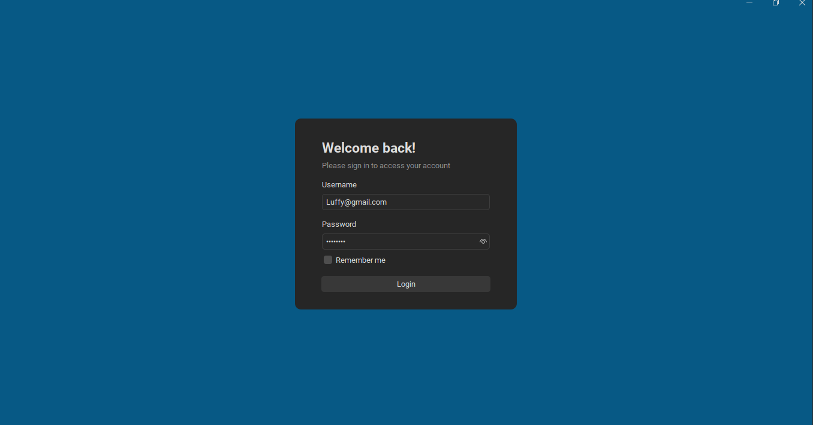
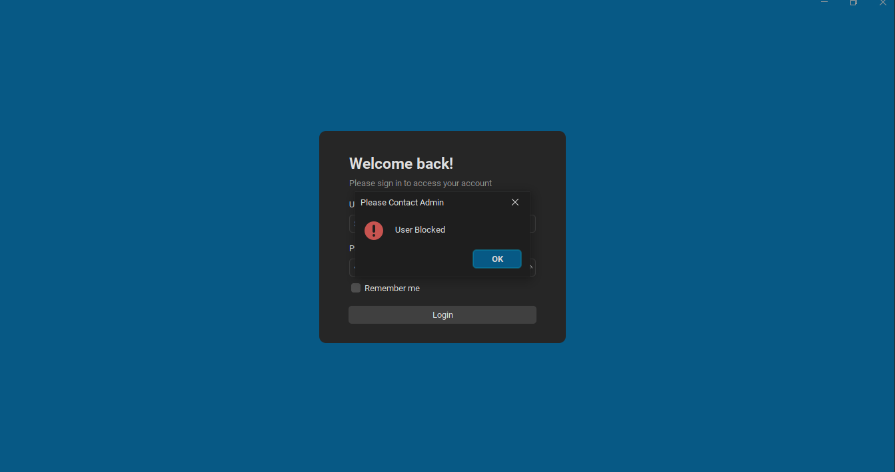

# Dashboard

Here's the VitePress markdown code for a document describing the dashboard features, including theme changing and side panel display according to user type:

# Dashboard Features

The dashboard in our application comes with several key features to enhance the user experience. This document provides an overview of the features, including theme changing and a dynamic side panel menu based on user type.

## Theme Changing

The dashboard supports theme changing, allowing users to switch between light and dark modes. This can be done seamlessly through the user interface.

### How to Change Theme

1. **Locate Theme Switcher**: The theme switcher is located in the top-right corner of the dashboard.
2. **Toggle Theme**: Click the theme switcher to toggle between light and dark themes.

### Benefits

- **Improved Readability**: Choose a theme that suits your lighting conditions for better readability.
- **User Preference**: Personalize the dashboard to match your aesthetic preferences.

## Side Panel Display

The side panel menu dynamically adjusts to display options based on the user's role. This ensures that users only see the menu items relevant to their permissions and responsibilities.

### User Types

1. **Admin**: Access to all features and settings.
2. **Cahier**: Access to Gem Order features.
3. **Lab**: Access to Create Lab Reports.

### GUI

#### Light Theme Interface
.png)

#### Dark Theme Interface

#### Error Handling

Handle Blocked User In the system

