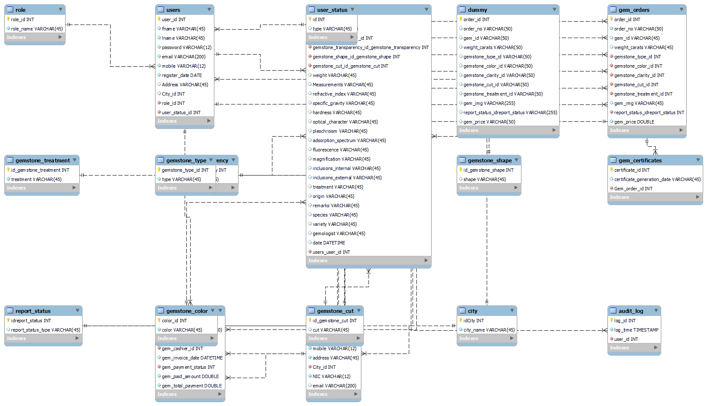

# Get Started

## System Requirements

### Hardware:

- **Processor:** Intel Core i3 or equivalent
- **RAM:** 4GB or higher
- **Storage:** 100MB of available disk space

### Software:

- **Operating System:** Windows 10, macOS, or Linux
- **Java Development Kit (JDK):** 8 or higher
- **IDE (Integrated Development Environment):** IntelliJ IDEA, Eclipse, or NetBeans
- **MySQL Database:** (optional, depending on project requirements)

## Installation Guide

### Install Java Development Kit (JDK):

- Download and install the latest JDK version compatible with your operating system from the official [Oracle website](https://www.oracle.com/java/technologies/javase-downloads.html) or adopt [OpenJDK](https://adoptopenjdk.net/).

### Setup IDE:

- Install your preferred IDE (IntelliJ IDEA, Eclipse, or NetBeans) and configure it with the installed JDK.

### Clone or Download Project:

- Clone the GemInsight System project repository from GitHub or download the project source code as a ZIP file.

### Import Project into IDE:

- Open your IDE and import the downloaded project into your workspace.

### Resolve Dependencies:

- If the project uses external libraries or dependencies, configure your IDE to include them in the project's build path. This may involve using build automation tools like Maven or Gradle.

### Setup Database :

- install and configure MySQL or any other supported database server. Execute SQL scripts provided with the project to create the necessary database schema and tables.

### ER Diagram :

### Run the Application:

- Build and run the project from your IDE. Follow any additional setup instructions provided in the project documentation.

