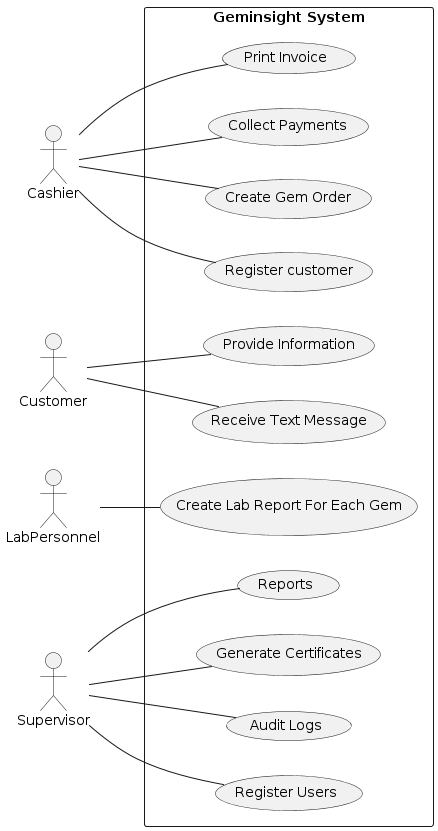
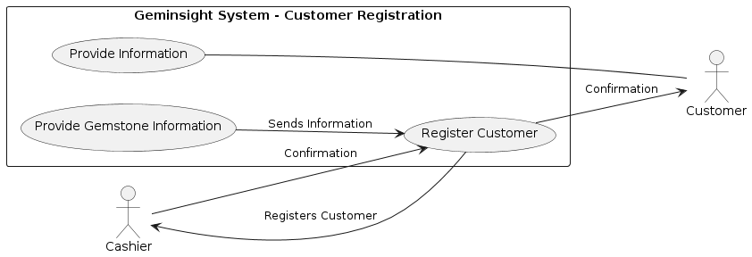
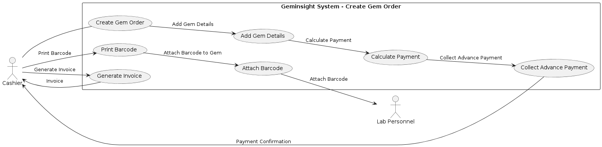
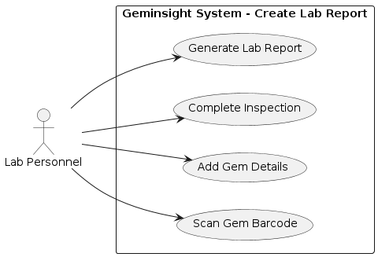
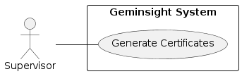
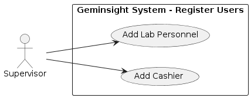
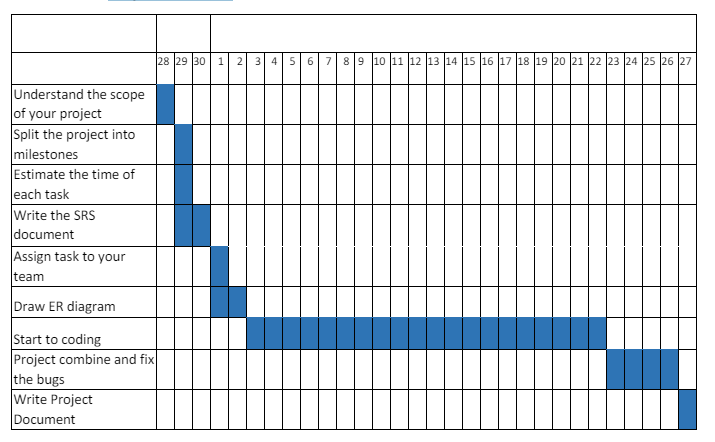

# Introduction

## What is GemInsight?

GemInsight is an innovative Java Swing Desktop application designed to revolutionize the way gemstone businesses manage their operations. With its intuitive user interface and powerful features, GemInsight streamlines various aspects of gemstone management, including inventory tracking, sales management, reporting, and more.

## Objectives

- To provide a user-friendly interface for generating gem certificates.
- To ensure certificates are formatted professionally with all necessary details.
- To enable saving and printing of certificates in an efficient manner. 

## Scope

GemInsight is an innovative Java Swing Desktop Application is a desktop-based software
solution that helps streamline the process of generating, managing and distributing
reports to the client, providing a complete report on gem value assessment, type, color,
weight and it gem or not. This website performs the actions of registering the
information of the client who comes with a gem and getting the report of the gem. Here
the client will be sent a text message after registering himself and after completing the
report. An administrator also uses the web portal in order to administer the system and
keep the information accurate.

## Deliverables

- Java Swing application for gem certificate generation, along with a user manual and
comprehensive project documentation.

## Assumptions and Constraints
- Assumes users have basic computer operation knowledge.
- The application must be compatible with Windows.

## Requirements Specification

 ### Functional Requirements
▪ Register Customer
 - Who is use our system we can call register customers.
▪ Create Gem Order
 - We can create gem order to our clients. Manly gem order can place
cashiers.
▪ Create Lab Report
 - Lab report can create lab supervisor manly generation gem report
▪ Generate Certificate
 - Certificate include gem details
▪ Register Users
 - Who work with this system we can call register users (cashiers, lab
reporter, lab supervisor)

▪ Collect Payments
 - We are providing 2 payment facility. Full payment & advance
payment 

### Non-Functional Requirements
▪ Login
 - We are creating multiple login option create this system
▪ Reports
 - Have many of report we were create in this project payment report ,
client report, gem report.
▪ Security
- We create best security option to our system like regax,condition
checking

## Key Features

- **Comprehensive Inventory Management:** Track and manage your gemstone inventory efficiently.
- **Customizable Reporting:** Generate custom reports to analyze your business data.
- **User-friendly Interface:** Intuitive UI designed for ease of use.
- **Sales Tracking:** Track your sales and analyze trends.
- **Customer Management:** Manage your customer information effectively.

## Use Case

### Main System Use case

- **Description:** Whether you're a small-scale gemstone retailer or a large wholesaler, GemInsight is tailored to meet your specific needs and help you succeed in today's competitive market.

**Actors:** 
- Cashier: Represents the personnel responsible for handling customer transactions and managing orders.
- Customer: Represents the individuals who interact with the system to purchase gemstones, provide information, and receive services.
- Lab Personnel: Represents the individuals responsible for creating lab reports for each gemstone.
- Supervisor: Represents the personnel responsible for supervising user registrations, managing audit logs, and overseeing the generation of certificates and reports.

**Use:** 

- Create Gem Order (UC2): Allows the cashier to create orders for gemstones on behalf of customers.
- Create Lab Report For Each Gem (UC3): Enables lab personnel to create detailed lab reports for each gemstone based on their inspection.
- Generate Certificates (UC4): Allows the supervisor to generate certificates for authenticated gemstones.
- Register Users (UC5): Enables the supervisor to register users, including cashiers and lab personnel, into the system.
- Audit Logs (UC6): Provides the supervisor with access to system logs for monitoring user activities and system events.
- Collect Payments (UC7): Allows the cashier to collect payments from customers for gemstone purchases and services.
- Reports (UC8): Provides the supervisor with the ability to generate various reports related to gemstone transactions and system usage.
- Print Invoice (UC12): Enables the cashier to print invoices for customers detailing their purchases and payments.
- Provide Information (UC9): Allows customers to provide necessary information to the cashier during transactions.
- Register Customer (UC10): Enables the cashier to register new customers into the system for future transactions.
- Receive Text Message (UC11): Sends text messages to customers to notify them about their registration status and other relevant information.

### Register Customer

### Create Gem Order

### Create Lab Report

### Generate Certificates

### Register Users

## Activity Diagram Scenarios

Here's a list of potential scenarios for activity diagrams in the Geminsight system:

1. **Customer Registration Process:**
   - Customer provides personal information to the cashier.
   - Cashier registers the customer into the system.
   - System sends a confirmation message to the registered customer.

2. **Gem Order Creation Process:**
   - Cashier creates a new gem order for a customer.
   - Cashier adds gem details to the order.
   - Cashier calculates the total payment for the order.

3. **Lab Report Creation Process:**
   - Lab personnel receive gems for inspection.
   - Lab personnel create a lab report for each gem.
   - Lab personnel mark the lab report as complete.

4. **Certificate Generation Process:**
   - Supervisor initiates the certificate generation process.
   - System generates certificates for authenticated gemstones.

5. **User Registration Process:**
   - Supervisor registers new users (cashiers, lab personnel) into the system.

6. **Audit Log Monitoring Process:**
   - Supervisor reviews audit logs to monitor user activities and system events.

7. **Payment Collection Process:**
   - Cashier collects payments from customers for gemstone purchases and services.

8. **Report Generation Process:**
   - Supervisor generates various reports related to gemstone transactions and system usage.

9. **Invoice Printing Process:**
   - Cashier prints invoices for customers detailing their purchases and payments.

10. **Customer Information Provision:**
   - Customers provide necessary information to cashiers during transactions.

11. **Customer Registration Confirmation:**
   - System sends a confirmation message to the registered customer.

12. **Certificate Authentication Process:**
   - Customer scans the QR code on the certificate to verify its authenticity.
   - System validates the certificate and displays its details to the customer.

   ## Project Management
### Project Timeline
