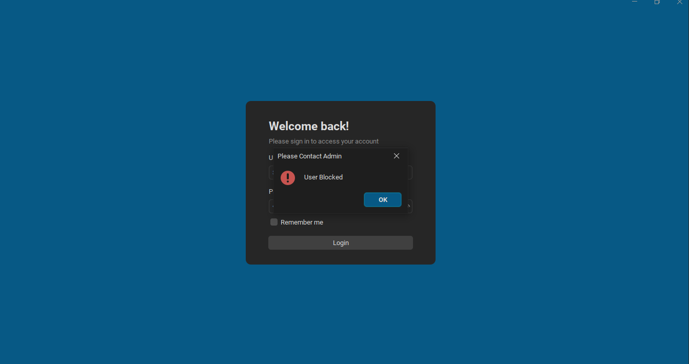

# Login Structure

## Description
The `Login` class is responsible for handling the user login functionality within a GUI application. It extends the `JPanel` class and provides the necessary components and event handling to authenticate users.

## Activity Diagram


In this Activity Diagram:
- The swimlanes represent the different actors involved: Customer and Caissier.
- The process starts with the Customer providing their information.
- The Caissier then verifies the provided information.
- Depending on whether the information is verified successfully or not, the Caissier either creates an order or notifies the Customer.
- The process ends after either the order is created or the Customer is notified.

## Class Variables
- `txtUsername`: A `JTextField` for entering the username.
- `txtPassword`: A `JPasswordField` for entering the password.
- `chRememberMe`: A `JCheckBox` for the "Remember me" option.
- `cmdLogin`: A `JButton` to trigger the login action.

## Login Code
```java
cmdLogin.addActionListener((e) -> {

            String username = txtUsername.getText();
            String password = String.valueOf(txtPassword.getPassword());

            try {
                ResultSet resultSet = MySQL.execute("SELECT * FROM `users` INNER JOIN `role` ON `users`.`role_id`= `role`.`role_id` WHERE `email` = '" + username + "' AND `password` = '" + password + "'");

                if (resultSet.next()) {

                    String userid = resultSet.getString("user_id");
                    String fname = resultSet.getString("fname");
                    String lname = resultSet.getString("lname");
                    String usertype = resultSet.getString("role.role_name");
                    String userstatus = resultSet.getString("user_status_id");

                    if (userstatus.equals("1")) {
                        Timestamp currentTimestamp = new Timestamp(System.currentTimeMillis());
                        MySQL.execute("INSERT INTO `audit_log`(`log_time`, `user_id`)"
                                + " VALUES('" + currentTimestamp + "','" + userid + "')");

                        String email = txtUsername.getText().trim();
                        
                        ModelUser loggedInUser = new ModelUser(email, fname, lname, usertype, userid);
                        FormManager.login(loggedInUser);
                        SessionManager.setLoggedInUser(loggedInUser);
                        
                    } else {
                        JOptionPane.showMessageDialog(this, "User Blocked", "Please Contact Admin", JOptionPane.ERROR_MESSAGE);
                        txtUsername.setText("");
                        txtPassword.setText("");
                    }

                } else {
                    JOptionPane.showMessageDialog(this, "Invalid Credentials", "Sign In Error", JOptionPane.ERROR_MESSAGE);
                }

            } catch (Exception g) {
                g.printStackTrace();
            }

        });
    }
```


## Overview

1. Retrieves the username and password from the input fields.
2. Queries the database to verify the user's credentials.
3. Checks the user's status.
4. Logs the user in if the credentials are correct and the user is active.
5. Displays error messages if the credentials are incorrect or the user is blocked.

## Code Explanation

### Retrieving Username and Password
```java
String username = txtUsername.getText();
String password = String.valueOf(txtPassword.getPassword());
```
- **username**: Retrieves the text entered in the username field.
- **password**: Retrieves the text entered in the password field and converts it to a string.

### Querying the Database
```java
ResultSet resultSet = MySQL.execute("SELECT * FROM `users` INNER JOIN `role` ON `users`.`role_id`= `role`.`role_id` WHERE `email` = '" + username + "' AND `password` = '" + password + "'");
```
- Executes a SQL query to check if there is a user with the entered username and password.
- The query joins the `users` table with the `role` table to get the user's role information.

### Processing the Query Result
```java
if (resultSet.next()) {
    String userid = resultSet.getString("user_id");
    String fname = resultSet.getString("fname");
    String lname = resultSet.getString("lname");
    String usertype = resultSet.getString("role.role_name");
    String userstatus = resultSet.getString("user_status_id");

    if (userstatus.equals("1")) {
        Timestamp currentTimestamp = new Timestamp(System.currentTimeMillis());
        MySQL.execute("INSERT INTO `audit_log`(`log_time`, `user_id`) VALUES('" + currentTimestamp + "','" + userid + "')");

        String email = txtUsername.getText().trim();
        
        ModelUser loggedInUser = new ModelUser(email, fname, lname, usertype, userid);
        FormManager.login(loggedInUser);
        SessionManager.setLoggedInUser(loggedInUser);
    } else {
        JOptionPane.showMessageDialog(this, "User Blocked", "Please Contact Admin", JOptionPane.ERROR_MESSAGE);
        txtUsername.setText("");
        txtPassword.setText("");
    }
} else {
    JOptionPane.showMessageDialog(this, "Invalid Credentials", "Sign In Error", JOptionPane.ERROR_MESSAGE);
}
```
- **if (resultSet.next())**: Checks if the query returned any results.
  - If the user exists:
    - Retrieves user details such as `user_id`, `fname`, `lname`, `role_name`, and `user_status_id`.
    - **if (userstatus.equals("1"))**: Checks if the user's status is active (`1`).
      - If the user is active:
        - Logs the current timestamp and user ID into the `audit_log` table.
        - Creates a `ModelUser` object for the logged-in user.
        - Calls `FormManager.login(loggedInUser)` to handle the successful login process.
        - Sets the logged-in user in `SessionManager`.
      - If the user is blocked:
        - Displays an error message "User Blocked" using `JOptionPane`.
        - Clears the username and password fields.
  - If the user does not exist:
    - Displays an error message "Invalid Credentials" using `JOptionPane`.

### Error Handling
```java
catch (Exception g) {
    g.printStackTrace();
}
```
- Catches any exceptions that occur during the database query or login process and prints the stack trace for debugging purposes.

## Summary
This event handler performs a series of checks and actions to authenticate a user based on the entered credentials. It interacts with the database to verify the user, handles different user statuses, and provides appropriate feedback to the user.


### GUI

#### Light Theme Interface


#### Dark Theme Interface


#### Error Handling

Handle Blocked User In the system




